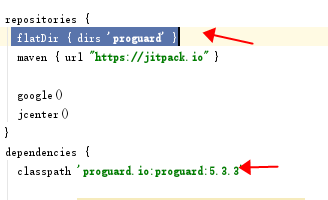
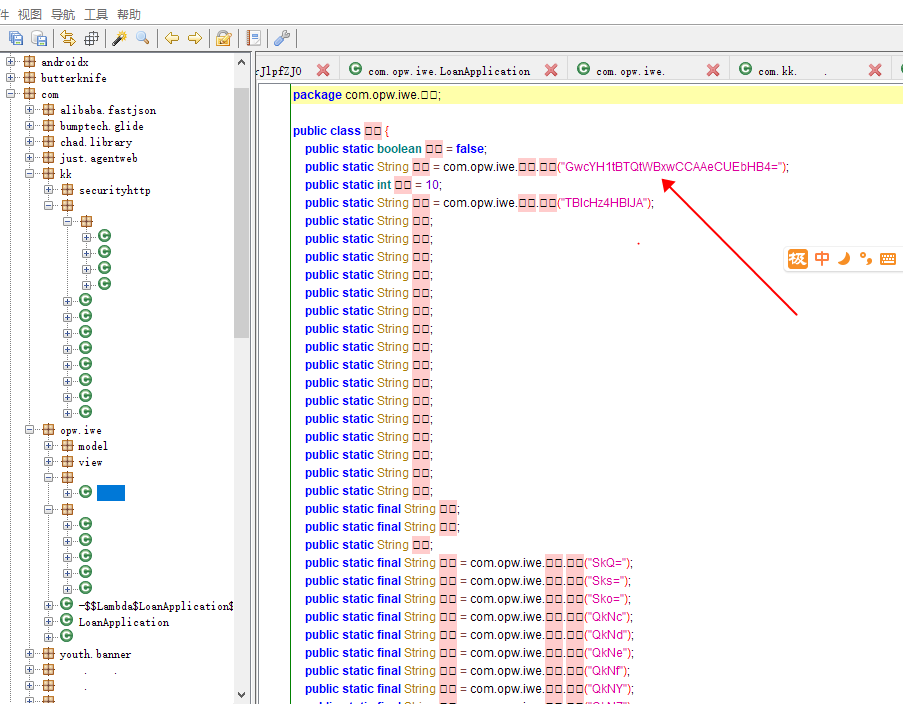
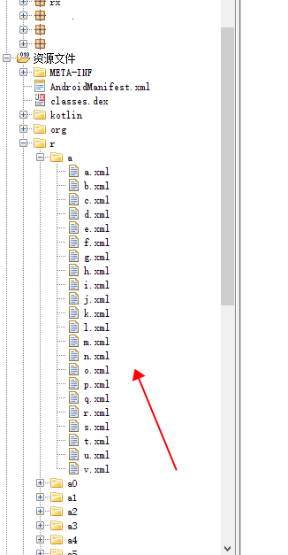

# 关于android apk混淆方案

## 字节码混淆方案

- [proguard](https://githfacebookarchiveub.com//proguard)  
- [原理](http://www.520monkey.com/archives/992)   
-     

## 字节码字符串混淆方案

- [asm](https://asm.ow2.io/)  
- [string](https://github.com/MegatronKing/StringFog/)  
- [原理](http://www.520monkey.com/archives/1313)   
-     

## 资源文件混淆方案

- [AndResGuard](https://github.com/shwenzhang/AndResGuard)
-     
